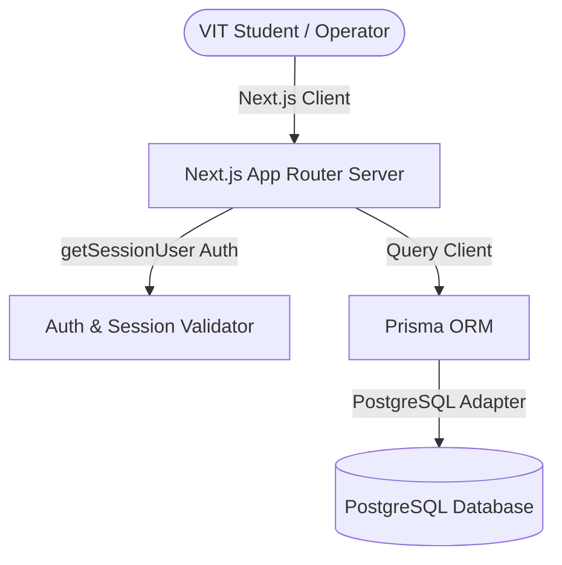
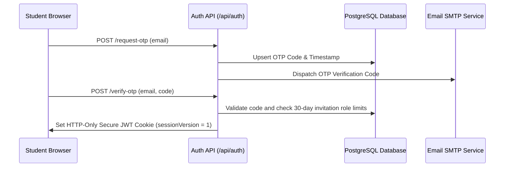

# SideQuest

### Hyperlocal Campus Marketplace | Built Exclusively for VIT Students

[](https://nextjs.org/)
[](https://www.typescriptlang.org/)
[](https://www.prisma.io/)
[](https://www.postgresql.org/)
[](https://jwt.io/)
[](https://web.dev/progressive-web-apps/)
[](/LICENSE)

---

SideQuest is a premium, hyperlocal peer-to-peer campus task marketplace designed exclusively for students and faculty at **Vellore Institute of Technology (VIT)**. It provides a secure, domain-restricted space to delegate daily chores, tutoring, and freelance work to fellow campus residents while preserving academic integrity and credit-based trust scores.

---

## 🚀 Live Demo
*(Placeholder: Production deployment URL pending)*
👉 [https://sidequest-vit.vercel.app](https://sidequest-vit.vercel.app)

---

## 📸 Screenshots
- **Landing Page & Browse Board**: Shimmering card layouts, location-based query inputs, and sorting.
- **Quest Details**: Counter-bidding options, deadline indicators, and poster metrics.
- **Real-Time Inbox**: Safe coordination chats, templates, and read-only locks.
- **Leaderboard**: Student standings ranked by active credit profiles.
- **Moderation Console (`/admin`)**: Logs tracking dispute resolutions, audit trails, and connection latency widgets.

---

## 🛠️ Tech Stack
- **Framework**: Next.js 16 (App Router, Turbopack compiling)
- **Language**: TypeScript
- **Database ORM**: Prisma Client
- **Database**: PostgreSQL (SSL Adapter connection pooling)
- **Styling**: Vanilla CSS (TailwindCSS avoided, custom slate-dark variables)
- **Token Authorization**: Secure HTTP-Only JWT Cookies

---

## 📐 System Workflow



### Request Flow


---

## 📁 Folder Structure

```text
SideQuest/
├── docs/                     # Engineering design guides
│   ├── API.md
│   ├── ARCHITECTURE.md
│   └── DATABASE.md
├── prisma/                   # Schema modeling & seeder scripts
│   ├── schema.prisma
│   └── seed.ts
├── public/                   # Static icons & PWA assets
│   └── manifest.json
└── src/
    ├── app/                  # Routing pages & endpoints
    │   ├── admin/            # Moderation dashboard
    │   ├── api/              # REST controllers
    │   ├── globals.css       # Slate dark style variables
    │   └── layout.tsx        # Toast and Shortcut providers
    ├── components/           # Icons, loaders, empty state cards
    ├── lib/                  # Auth checks & JWT tokens
    └── tests/                # Business logic testing rules
```

---

## 🔧 Installation & Local Setup

1. **Clone the repository**:
   ```bash
   git clone https://github.com/Eraiyamuthan-P/SideQuest.git
   cd SideQuest
   ```

2. **Install dependencies**:
   ```bash
   npm install
   ```

3. **Configure Environment Variables**:
   ```bash
   cp .env.example .env
   ```

4. **Sync Schema & Seed Data**:
   ```bash
   npx prisma db push
   npx tsx prisma/seed.ts
   ```

5. **Start Dev Server**:
   ```bash
   npm run dev
   ```

---

## 🧪 Testing

We run a strict suite of unit tests to verify business operations before compilation passes:

```bash
npm run test
```

### Build Check
```bash
npm run build
```

---

## 🛡️ Security Configuration
- **Access Restrictions**: Only `@vitstudent.ac.in` handles are permitted to authenticate.
- **Session Revocation**: Stale JWT tokens are rejected immediately when database `sessionVersion` increments during moderation updates.
- **Soft Deletes**: Suspended profiles are hidden while maintaining audit logs for compliance tracking.

---

## 📄 License
This project is licensed under the MIT License. See the [LICENSE](/LICENSE) file for details.

---

## ✍️ Author
Developed with ❤️ by **Eraiyamuthan** (VIT University).
