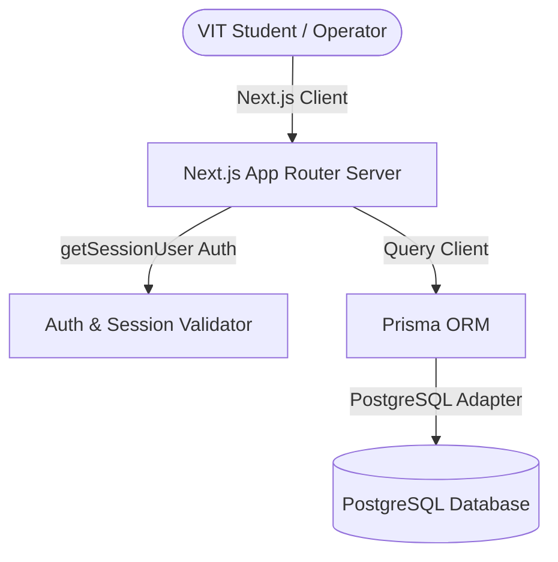
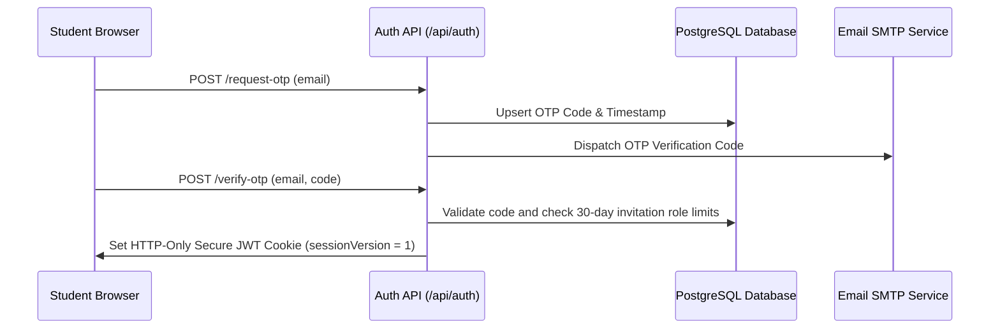

# SideQuest Technical Architecture

This document describes the design patterns, runtime environment, data flow, and security specifications of SideQuest.

---

## 🏗️ System Overview

SideQuest is a full-stack Next.js web application utilizing the React App Router architecture.

---

## 🔐 Authentication Flow

SideQuest features a closed OTP verification flow for `@vitstudent.ac.in` emails:

---

## 🛡️ Security Hierarchy

We implement a strict multi-tier role-based access control layout:

| Role | Permissions |
| ---- | ----------- |
| `STUDENT` | Create quests, bid, counter-bid, chat, and review fellow students. |
| `MODERATOR` | View support tickets, resolve active disputes, edit student verification. |
| `ADMIN` | Suspend or ban students, promote moderators, demote moderators. |
| `SUPER_ADMIN` | Permanent platform owners, manage admin invites, promote admins. |
